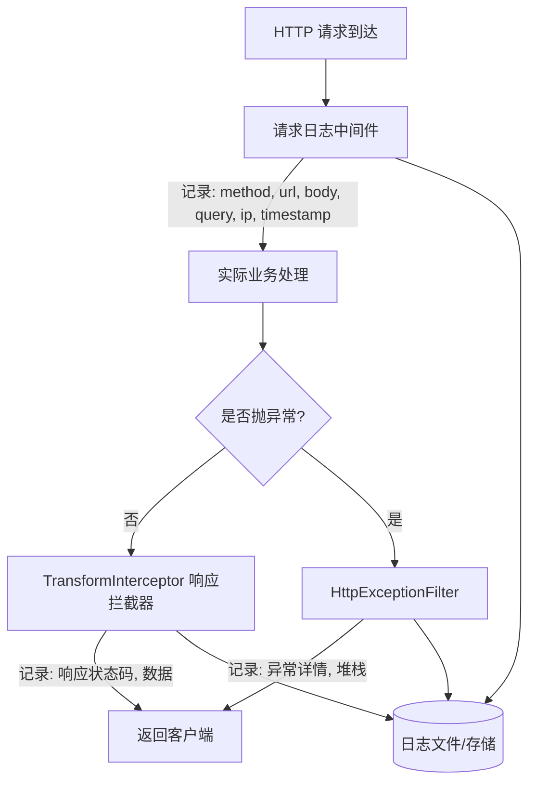

# 附录：接口与存储矩阵

## A. 核心接口（NestJS）

| 方法 | 路径 | 传参 | 返回数据 | 说明 |
|------|------|------|---------|------|
| GET | `project/getAllProject` | `pageSize: number; pageNumber: number` | `{ data: { page: { pageSize, total }, tableData: { projectName, projectDesc, projectId, rowNum }[] } }` | 获取项目列表，支持分页 |
| GET | `/project/editDataFile` | `projectId: string` | `{ data: { url: string } }` | 项目 JSON 数据导出 |
| POST | `/project/createProject` | `{ projectName: string; projectDesc: string }` | `{ data: [], message: string }` | 创建新项目 |
| DELETE | `/project/delProject` | `projectIds: string[]` | `{ data: [], message: string }` | 删除项目 |
| POST | `/editData/importEditData` | `{ projectId: string; data: X6 JSON }` | 成功/失败通过 code 区分 | 导入本地 JSON 数据 |
| POST | `/editData/updateEditData` | `{ projectId: string; data: X6 JSON }` | 成功/失败通过 code 区分 | 保存编辑器数据 |
| GET | `editData/getEditDataById` | `projectId: string` | `{ data: X6 JSON }` | 获取编辑的 JSON 数据 |

::: tip 接口设计说明
JSON 数据比较大时，成功也不返回数据，通过 code 区分成功/失败。这是性能与带宽的考量。
:::

## B. 存储职责矩阵

详见[存储层设计](./backend/storage.md)——两种存储（PostgreSQL + pgvector / Redis）的职责划分、选型理由和关联设计均在该章完整展开。

## C. 后端模块划分

| 模块 | 职责 |
|------|------|
| auth | 登录注册、JWT 鉴权 |
| user | 用户管理 |
| project | 项目 CRUD、分页 |
| editData | 编辑器数据导入/导出/保存 |
| search | PostgreSQL 全文检索（tsvector + GIN）项目与内容搜索 |
| ai | Agent 编排（LangGraph 状态图） |

## D. 日志系统

## E. 后端环境配置

详见[存储层设计](./backend/storage.md#4-后端环境变量示例)——PostgreSQL、Redis 的连接配置示例均在该章列出。

## F. 项目时间线

- 项目开始时间：2024.10.19
- 第一版期望结束时间：2024.10.27
- 实际后端完成时间：2024.11.22
- 2024.11.23 开始整体前端逻辑
