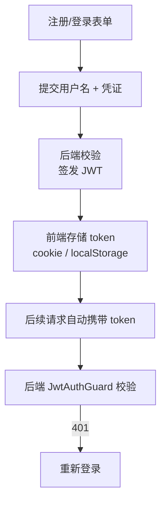
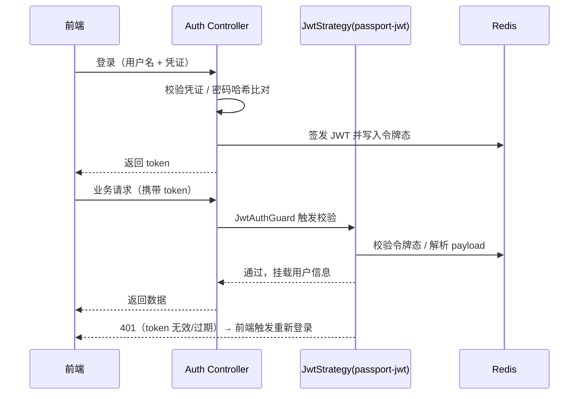

# 登录鉴权

登录鉴权是语图后端 `auth` 模块的核心职责：注册/登录/登出、JWT 签发与校验、登录会话态（令牌态）管理。本页先讲前端在认证环节的职责（表单、头像、token 携带），再讲后端如何用 `passport-jwt` + Redis 落地 JWT 签发校验，以及踩过的实现坑。

## 1. 前端职责

> 资料原文（登录小节 · 前端部分）：
> 1. 注册登录的表单，用户头像展示
> 2. 如何携带上 token

前端在认证环节关注三件事：**表单、头像、token 携带**。

## 2. 注册 / 登录表单

- 提供注册与登录的表单页（基于 antd 的 Form 组件）。
- 注册：提交用户名（资料明确"应该是存用户名不存密码"——密码相关校验/加密逻辑由后端处理，前端只采集并传输）。
- 登录 / 登出：调用后端鉴权接口，拿到 token 后驱动前端路由的登录态。

## 3. 用户头像展示

- 用户注册后先给一个**默认头像**，避免头像缺失的空白态。
- 登录后在界面（如项目管理、个人区）展示用户头像。

## 4. token 携带方式

这是前端需要决策的点：**token 存 cookie 还是 localStorage？**

| 方案        | 优点                                       | 注意点                                         |
| ----------- | ------------------------------------------ | ---------------------------------------------- |
| cookie      | 自动随请求携带；可设 HttpOnly 防 XSS       | 需处理跨域（withCredentials）、CSRF 防护       |
| localStorage| 前端读取方便、无跨域 cookie 限制           | 需手动注入请求头；XSS 风险更高，需做好防护     |

无论哪种，前端都要在**每次业务请求**（项目、编辑器数据、搜索、AI 对话）中把 token 带上，否则后端 `JwtAuthGuard` 会拦截。

::: warning 后端配合
后端使用 `@UseGuards(JwtAuthGuard)` 的独立守卫（等价于 `AuthGuard('jwt')`）。资料中踩过的坑：① `JwtStrategy` 的 `Strategy` 应从 `passport-jwt` 导入而非 `passport-local`，否则会错误地进入 local 策略；② 要明确 `JwtAuthGuard` 是单独守卫。前端只需保证 token 正确携带，异常 401 时触发重新登录流程即可。
:::

## 5. 交互流程

## 6. 后端鉴权实现（passport-jwt + Redis）

登录鉴权真正落地在 NestJS 的 `auth` 模块：注册/登录由后端处理密码相关校验（前端只采集用户名），登录成功后签发 JWT 并将令牌态写入 Redis；后续每个请求携带 token，由 `JwtAuthGuard` 统一校验，未通过直接 401。

### 6.1 JWT 签发与校验

- 登录接口校验凭证（密码哈希比对等由后端完成），通过后用 `jsonwebtoken` 签发 JWT，并将令牌态（登录会话态）写入 **Redis**（可主动吊销、支持多端登录管理）。
- 请求进入时由 `JwtStrategy`（`passport-jwt`）解析并校验 token，把 payload（用户标识等）挂到请求对象，供后续 Controller / Service 使用。

### 6.2 守卫与策略踩坑

::: warning 必须注意的实现坑
- `JwtStrategy` 的 `Strategy` 要从 **`passport-jwt`** 导入，而不是 `passport-local`，否则会错误地进入 local 策略，导致鉴权链路跑偏。
- `JwtAuthGuard` 是**独立守卫**，用 `@UseGuards(JwtAuthGuard)` 显式挂载（等价于 `AuthGuard('jwt')`）。要明确它是单独守卫，不要和业务守卫混用。
:::

### 6.3 鉴权流程

