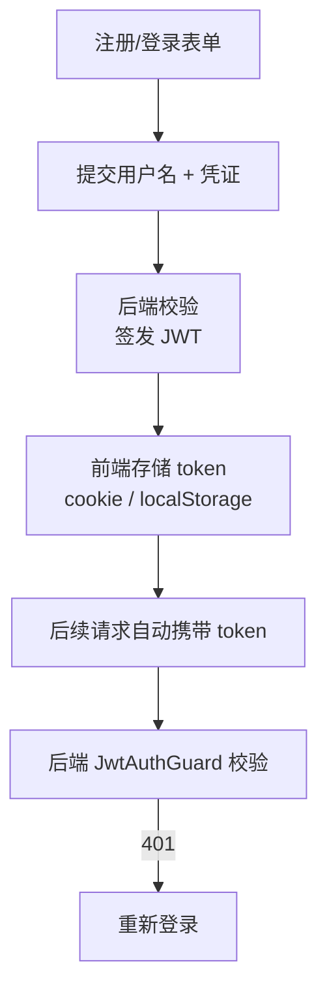
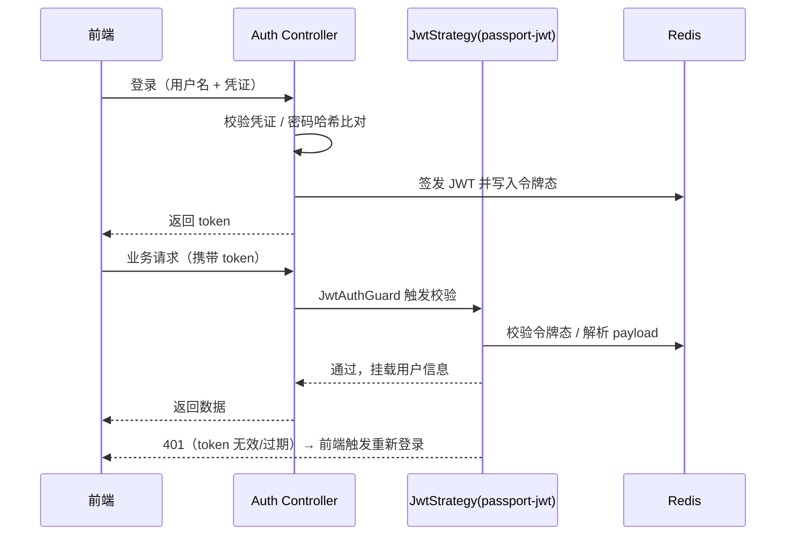

# 登录鉴权

登录鉴权是语图后端 `auth` 模块的核心职责：注册/登录/登出、JWT 签发与校验、令牌态管理。前端负责表单采集（antd Form）、默认头像展示和 token 携带，后端用 `passport-jwt` + Redis 落地 JWT 签发校验。

## token 携带方式

前端需要决策：**token 存 cookie 还是 localStorage？**

| 方案        | 优点                                       | 注意点                                         |
| ----------- | ------------------------------------------ | ---------------------------------------------- |
| cookie      | 自动随请求携带；可设 HttpOnly 防 XSS       | 需处理跨域（withCredentials）、CSRF 防护       |
| localStorage| 前端读取方便、无跨域 cookie 限制           | 需手动注入请求头；XSS 风险更高，需做好防护     |

无论哪种，前端都要在**每次业务请求**（项目、编辑器数据、搜索、AI 对话）中把 token 带上，否则后端 `JwtAuthGuard` 会拦截，返回 401 触发重新登录。

## 交互流程

## 后端鉴权实现（passport-jwt + Redis）

登录鉴权真正落地在 NestJS 的 `auth` 模块：注册/登录由后端处理密码相关校验（前端只采集用户名），登录成功后签发 JWT 并将令牌态写入 Redis；后续每个请求携带 token，由 `JwtAuthGuard` 统一校验，未通过直接 401。

### JWT 签发与校验

- 登录接口校验凭证（密码哈希比对等由后端完成），通过后用 `jsonwebtoken` 签发 JWT，并将令牌态（登录会话态）写入 **Redis**（可主动吊销、支持多端登录管理）。
- 请求进入时由 `JwtStrategy`（`passport-jwt`）解析并校验 token，把 payload（用户标识等）挂到请求对象，供后续 Controller / Service 使用。

### 守卫与策略踩坑

::: warning 必须注意的实现坑
- `JwtStrategy` 的 `Strategy` 要从 **`passport-jwt`** 导入，而不是 `passport-local`，否则会错误地进入 local 策略，导致鉴权链路跑偏。
- `JwtAuthGuard` 是**独立守卫**，用 `@UseGuards(JwtAuthGuard)` 显式挂载（等价于 `AuthGuard('jwt')`）。要明确它是单独守卫，不要和业务守卫混用。
:::

### 鉴权流程

