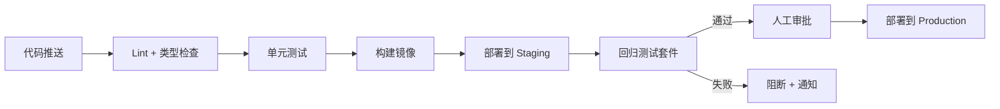

# 部署

语图后端（NestJS 模块化单体）上线需要一套稳定的测试、发版与运维流程，才能在快速迭代中守住质量底线。本页覆盖测试用例来源、发版回归闸门（详见《评估与可观测性》）、CI/CD 流程、容器化部署、监控与回滚策略，以及升级维护的踩坑经验。

## 1. 测试：用例从哪来

测试用例的三种生成策略（手工写、模型生成变体、生产回放）详见《[评估与可观测性](./evaluation.md#7-4-测试用例生成策略)》。这里只强调一点：AI 应用的测试用例需要**持续维护**——每次发现 Bad Case 都要加入回归集，确保同类问题不再复现。

## 2. 发版标准（回归闸门）

AI 流程图发版必须过固定用例集全量回归闸门，具体指标见《[评估与可观测性](./evaluation.md#7-2-发版标准-回归闸门)》。核心要点：

- 格式合规率 100%（JSON 不合法直接卡死）
- 意图识别准确率 ≥ 95%、工具调用成功率 ≥ 98%
- 历史 Bad Case 零劣化

::: warning 为什么发版标准放在评估章节
发版标准本质是评估指标的"硬约束"——它和评估维度、组件评估共享同一套数据。放在一起维护，避免两处修改不一致。
:::

## 3. CI/CD 流程

语图的 CI/CD 围绕"AI 应用的不确定性"做了针对性设计：



### 各阶段职责

| 阶段 | 内容 | 阻断条件 |
|------|------|---------|
| Lint + 类型检查 | ESLint + TypeScript 编译 | 任何 error 级别问题 |
| 单元测试 | Service 层核心逻辑、工具调用 mock 测试 | 覆盖率低于阈值或用例失败 |
| 构建镜像 | Docker 多阶段构建（见下节） | 构建失败 |
| 回归测试套件 | 固定用例集全量回归，统计评估指标 | 任一指标跌破闸门 |
| 人工审批 | 查看回归报告，确认 Bad Case 无劣化 | 审批拒绝 |

### AI 应用的 CI 特殊点

传统 CI 跑完测试就知道能不能发，AI 应用不行——模型输出有随机性，同样的输入可能产出不同结果。语图的应对方式：

- **固定 seed**：回归测试中固定模型 temperature 为 0（或极低值），减少随机性干扰
- **统计而非断言**：不用"某 case 必须输出 X"的硬断言，而是统计"100 个 case 中格式合规率 ≥ 99%"的软指标
- **Bad Case 回归**：维护一个已知问题 case 集，每次发版前跑一遍，确认没有新增问题

## 4. 容器化部署

### Docker 多阶段构建

```dockerfile
# 构建阶段
FROM node:20-alpine AS builder
WORKDIR /app
COPY package.json pnpm-lock.yaml ./
RUN corepack enable && pnpm install --frozen-lockfile
COPY . .
RUN pnpm build

# 运行阶段
FROM node:20-alpine AS runner
WORKDIR /app
COPY --from=builder /app/dist ./dist
COPY --from=builder /app/node_modules ./node_modules
COPY --from=builder /app/package.json ./
EXPOSE 3000
CMD ["node", "dist/main.js"]
```

### 环境变量管理

生产环境通过环境变量注入配置（数据库连接、Redis 地址、API Key 等），不打包进镜像。敏感配置（数据库密码、JWT Secret）通过密钥管理服务或 `.env` 文件在部署时注入，不进版本控制。

## 5. 监控与告警

### 应用层监控

| 维度 | 工具 | 说明 |
|------|------|------|
| 全链路追踪 | Langfuse | LLM 调用链路 trace：输入/输出、Token 消耗、工具调用、延迟 |
| 应用日志 | NestJS Logger + 文件/ELK | 请求日志、异常堆栈、业务日志 |
| 健康检查 | NestJS `@nestjs/terminus` | `/health` 端点检查 DB/Redis 连通性 |

### 告警规则

| 告警项 | 阈值 | 响应 |
|--------|------|------|
| LLM 调用错误率 | > 5% / 5min | 检查模型服务状态，必要时切换备用模型 |
| 平均响应延迟 | > 10s | 检查模型服务负载，考虑降级策略 |
| Token 日消耗量 | > 配额 80% | 预警通知，准备降级 |
| 服务健康检查失败 | 连续 3 次 | 自动重启 + 通知 |

### Langfuse 在监控中的角色

Langfuse 不仅是开发调试工具，也是生产监控的数据源。通过 Langfuse API 可以定时拉取关键指标（错误率、延迟、Token 消耗），接入告警系统。当发现异常时，直接到 Langfuse 控制台查看对应 trace 的完整链路，快速定位是模型问题、工具问题还是上下文问题。

## 6. 回滚策略

AI 应用的回滚比传统应用更复杂——不仅要回滚代码，还可能要回滚模型版本或 Prompt 版本。

**代码回滚**：Docker 镜像标签化，每次部署打 tag，回滚时直接切回上一版本的镜像。

**Prompt 回滚**：System Prompt 和工具描述纳入版本控制（或 Langfuse Prompt Management），发现问题可快速切回上一版 Prompt。

**模型回滚**：模型版本通过环境变量配置，切换模型只需改配置并重启，不需要重新构建镜像。

**数据回滚**：Checkpointer 的 State 按 thread_id + checkpoint_id 存储，理论上支持回退到任意历史检查点（用于调试和恢复）。

## 7. 上线前检查清单

- [ ] 对用户增加**每日 Token 消耗限制**（安全章节 → [安全检查清单](./security.md#10-7-安全检查清单)）
- [ ] 固定用例集全量回归过闸门
- [ ] 历史 Bad Case 零劣化复核
- [ ] 环境变量已配置（PostgreSQL、Redis、LLM API Key）
- [ ] 健康检查端点可用
- [ ] Langfuse 已接入且 trace 正常
- [ ] HTTPS 已启用，CORS 白名单已配置

## 8. 升级与维护踩坑

> 核心原则：旧项目维护时，业务能满足就**不要盲目升级依赖**。

详细的踩坑记录（antv-x6 / react-query 升级失败、依赖连锁反应等）和"依赖升级的安全做法"见《[工程化踩坑与质量属性](../engineering.md#依赖升级的风险)》。

这里补充一条部署视角的经验：**升级依赖后一定要跑 AI 回归测试**。代码编译通过不代表 AI 行为没变——模型输出对上下文极其敏感，依赖升级如果改变了序列化顺序或数据结构，可能间接影响模型输出。

- 相关：[评估与可观测性](./evaluation.md) · [安全](./security.md) · [后端概述](./backend/index.md) · [AI 编排运行时](./backend/ai-runtime.md)
