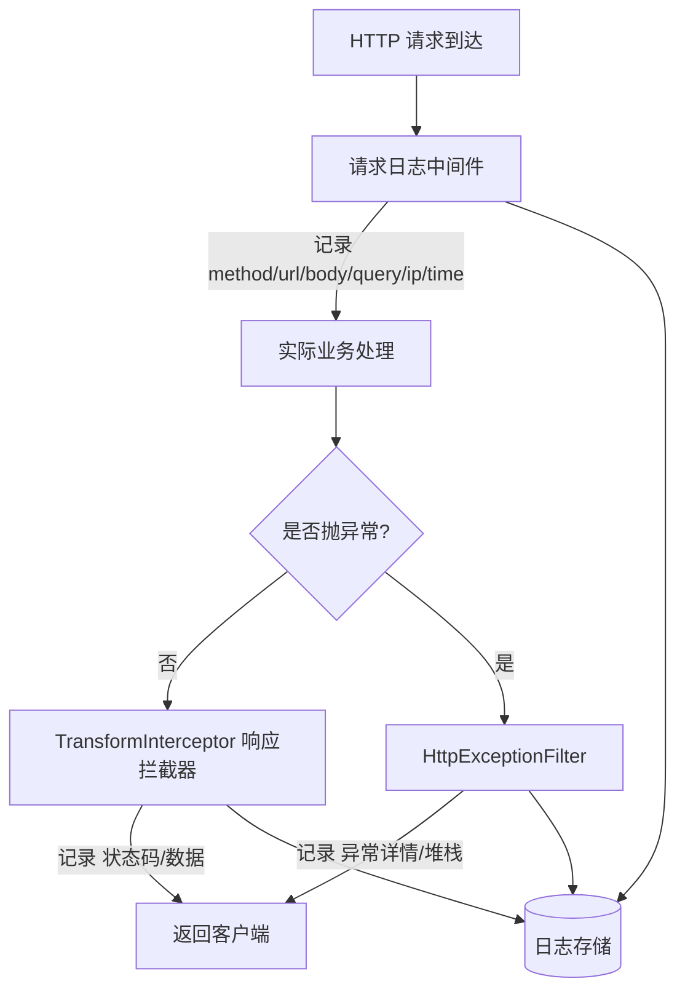
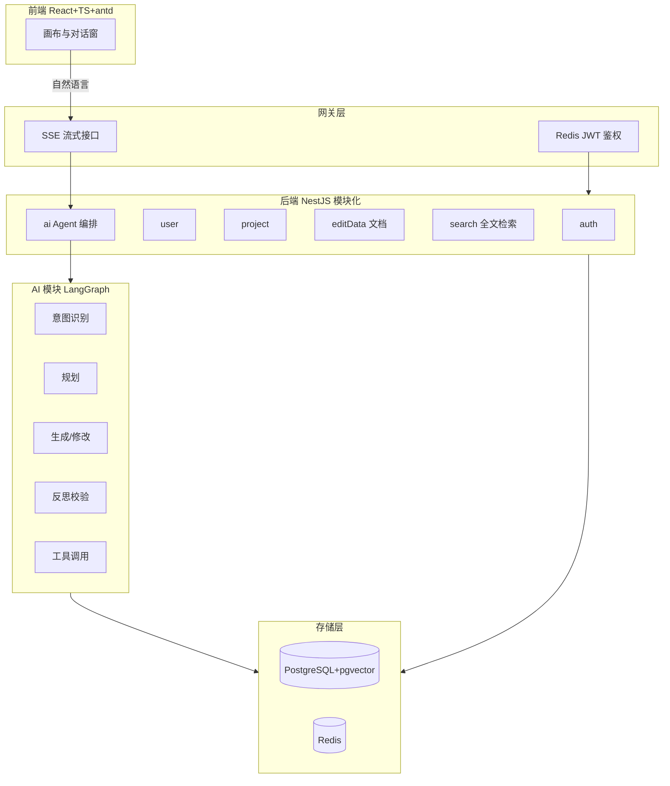

# 后端

语图的后端不是"给前端透传模型的代理"，而是 Agent 能够稳定跑起来的**世界（Harness）**：它用 NestJS 把鉴权、项目管理、文档存储、检索、AI 编排收拢成一个模块化单体，向上承接前端 SSE 流式对话，向下调度存储层与 LLM。本页先说清后端在语图里的位置、技术选型、六大模块与一次请求的完整生命周期，后续《AI 编排运行时》《存储层设计》《登录鉴权》《流式输出》《部署》《评估与可观测性》再逐块展开。

## 1. 技术选型

| 层 | 技术选型 | 职责 |
| --- | --- | --- |
| 应用框架 | NestJS + TypeScript | 模块化单体：auth / user / project / editor / search / ai |
| 鉴权 | passport-jwt + Redis | JWT 签发与校验，令牌态落 Redis |
| AI 编排 | LangGraph 状态图 | 意图→规划→生成→反思→工具的图编排 |
| 通信 | SSE（@Sse + RxJS） | 对话接口流式推送，逐 token 产出 |
| 可观测性 | Langfuse | 全链路 trace + 日志，打开 LLM 黑盒 |
| 存储 | PostgreSQL + pgvector / Redis | 见《存储层设计》 |

::: tip 为什么用 NestJS
当时全组从 JS 转用 TS，Nest 原生支持 TS；之前用过 Express，对使用 Nest 上手更平滑。NestJS 提供了基于模块、控制器、服务和提供者的清晰架构，依赖注入、中间件、管道、守卫、拦截器、异常过滤器等特性非常适合企业级应用。相比之下 Next.js 偏前端渲染，不是后端 API 服务的首选。
:::

## 2. 模块化架构

NestJS 的核心是用**模块（Module）/ 控制器（Controller）/ 服务（Service）/ 提供者（Provider）**组织代码，配合依赖注入（DI）解耦。

- **Controller**：接收 HTTP 请求，做路由与入参校验（Pipe），不写业务。
- **Service**：业务逻辑与数据库访问，被 Controller 通过构造函数注入。
- **Provider**：可注入的任意类（client、策略、守卫等）。
- **Middleware / Pipe / Guard / Interceptor / Filter**：在请求生命周期的不同阶段横切处理（日志、校验、鉴权、响应包装、异常）。

```typescript
@Module({
  controllers: [ProjectController],
  providers: [ProjectService, EditDataService],
  imports: [AuthModule, SearchModule], // 跨模块复用
})
export class ProjectModule {}
```

六大业务模块：

| 模块 | 职责 | 关键存储 |
| --- | --- | --- |
| auth | 注册/登录/登出、JWT 签发、头像 | Redis（令牌态/JWT）、PG（用户） |
| user | 用户信息、画像 | PG（画像命名空间） |
| project | 项目 CRUD、分页、列表 | PG（关系表 + tsvector 全文检索） |
| editor（editData） | 流程图文档保存/读取/导入导出（X6 JSON） | PG（JSONB） |
| search | 全文索引与检索 | PG（tsvector + GIN） |
| ai | Agent 编排入口、SSE 对话流、记忆调度 | PG（Checkpointer/Store） |

## 3. 请求生命周期（统一处理）

所有请求走同一套横切逻辑：日志中间件记录入参，业务处理，最后由响应拦截器统一包装或异常过滤器捕获。



- **请求日志中间件**：记录 method、url、body、query、ip、timestamp。
- **TransformInterceptor**：统一成功响应结构（code/data/message），并记录响应状态码与数据。
- **HttpExceptionFilter**：捕获业务异常，记录异常详情与堆栈，返回统一错误结构。
- **序列化/反序列化**：用 class-transformer（`@Expose` / `plainToInstance` / `instanceToPlain`）定义传参与返回结构，隔离前后端内部逻辑（踩坑：字段名不一致、对 class-transformer 不熟曾绕弯路）。

## 4. 后端与 AI 模块的关系

`ai` 模块是后端的"特殊居民"：它本身不直接服务 CRUD，而是作为 LangGraph 状态图的编排入口，接收前端对话请求，驱动意图→规划→生成→反思→工具的循环，并通过 SSE 把流式结果回推。AI 模块的短期记忆（Checkpointer）与长期记忆（Store）落在 PostgreSQL，与业务库同库不同表，同进程调度。详见《AI 编排运行时》。

## 5. 后端模块结构图



## 6. 相关页面

- [AI 编排运行时（LangGraph）](./ai-runtime.md)：状态图、Checkpointer、Store、Human-in-the-loop
- [存储层设计](./storage.md)：PG + pgvector / Redis 的职责划分与关联设计
- [登录鉴权](./auth.md)：JWT+Redis 签发校验、passport-jwt 守卫
- [部署](./deploy.md)：测试与发版标准、上线前检查
