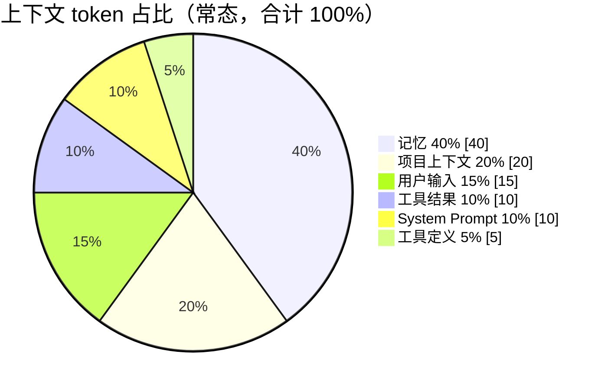

# 上下文管理与提示词工程

## Prompt 构成

```
Prompt = 【system prompt】 + 【user question】 + 【流程图 json】 + 【history】

history = last K（近期原文） + summary（长期摘要） + 向量检索（相关片段）
```

## 系统提示词 vs 向量数据库

::: tip 关键区分
流程图模板、规范等是**大量文本**，作为 system prompt 太浪费 token；存入向量库做相似片段召回，可大幅节省 token。结论：**大量文本片段存向量库更合适；system prompt 适合做背景介绍**。

两者差异——system prompt 是自然语言，向量库是向量形式且可做相似度计算。
:::

| 场景 | 使用系统提示词 | 使用向量数据库 |
|------|:---:|:---:|
| 背景介绍 / 角色设定 | ✓ | ✗ |
| 流程图设计规范（大量文本） | ✗（浪费 token） | ✓（召回相似片段） |
| 流程图模板 | ✗ | ✓ |
| 指令 / 输出格式约束 | ✓ | ✗ |

## 上下文组装与 Token 预算

### State 化管理

用 LangGraph State 管理上下文，每个节点维护自己需要的部分，组装节点读取各部分拼成完整 context。

### 差异化组装

| 意图 | 是否注入画布内容 | 说明 |
|------|:---:|------|
| generate | ✗ | 没有现有图 |
| modify | ✓（完整 FlowDraft） | 注入当前画布完整语义结构（带节点/边 ID），供模型复用 ID 做增量 diff |
| consult | ✗ | 纯问答 |

重要信息放输入开头或结尾（应对"lost-in-the-middle"现象）。

### Token 上限

输入 token 卡在模型上下文上限的 **80%**。



哪部分畸高砍哪部分。

### Token 预算管理策略

| 策略 | 思路 | 优点 | 缺点 |
|------|------|------|------|
| 控总量 | 给 prompt 预设总 token 上限，动态分配 | 保证不超限，灵活 | 实现复杂，要实时计算 token |
| 控条数 | 固定 last K=3, summary=1 条, 向量=3 条 | 实现简单 | 系统提示词很长时可能超限 |

实际采用**组合策略**——以控总量为主，控条数做安全兜底。

## 向量检索后处理

从向量库召回的结果经**后处理**再包装成纯文本喂给模型：

```
召回 top-k → 重排序(rerank) / 去重 / 截断 / 过滤低分 → 按固定模板组装为 [资料N] 段落
```

模板格式：

```text
请根据以下参考资料回答用户问题：
===
[资料1] 内容 A……
===
[资料2] 内容 B……
===
用户问题：……
```

::: tip 对模型而言
它只看到普通文本上下文，并不知这些曾是向量。向量检索的后处理完全在代码层完成，模型无感知。
:::

## 上下文优先级规则

| 维度 | 优先级 | 说明 |
|------|:------:|------|
| 当前会话 | 最高 | 最近 K 轮对话全量召回 |
| 同项目其他会话 | 中 | 通过 summary + 向量检索召回 |
| 其他项目 | 低 | 仅在向量检索高度相关时才召回 |

- **last K**：取最近 3 轮（全量原文）
- **summary**：取 1~3 条
- **向量检索**：取 2~5 条高相似片段

## 并行双路检索优化

向量召回和 LLM 首 token 推理可以并行启动：

```
0 ms: 用户请求进入
  -> 协程 A：异步调用向量库（网络 IO）
  -> 协程 B：提前做 LLM 前置流水线（tokenizer + GPU 排队）
5 ms: 向量库返回结果 -> 替换占位符（纯 CPU，<0.2ms）
21 ms: GPU 轮到本请求 -> 开始 forward
```

::: tip 关键结论
向量召回和 LLM 首次 forward 是同时启动的；LLM 真正需要"外部知识"时已经是 20ms 之后，此时召回结果 100% 就绪。向量召回增量只有 2-3ms，被"藏"在 LLM 自己排队里的时间。
:::

## 控制向量数据量

| 策略 | 说明 |
|------|------|
| 窗口化 | 10 条对话存一次向量 |
| 时间维度 | 3 个月之前的向量内容做摘要存入 PostgreSQL |
| 向量降维 | 768 → 384 / 256 |
