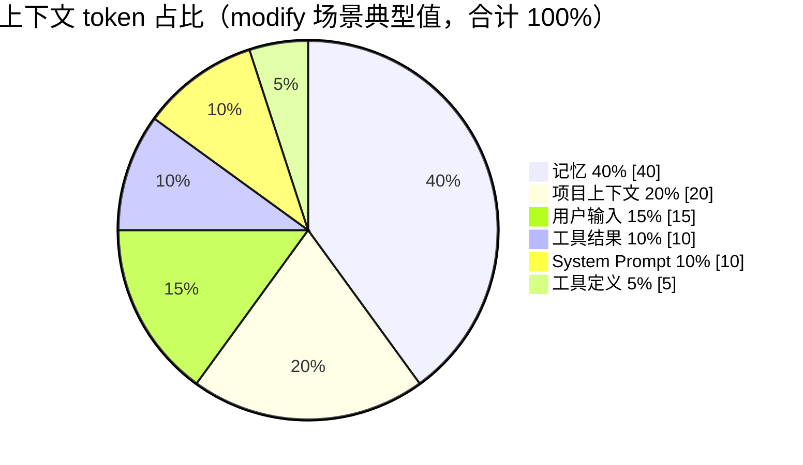

# 上下文管理与提示词工程

## Prompt 构成

```
Prompt = 【system prompt】 + 【user question】 + 【流程图 json】 + 【history】

history = last K（近期原文） + summary（长期摘要） + 向量检索（相关片段）
```

## 系统提示词 vs 向量数据库

::: tip 关键区分
流程图模板、规范等是**大量文本**，作为 system prompt 太浪费 token；存入向量库做相似片段召回，可大幅节省 token。结论：**大量文本片段存向量库更合适；system prompt 适合做背景介绍**。

两者差异——system prompt 是自然语言，向量库是向量形式且可做相似度计算。
:::

| 场景 | 使用系统提示词 | 使用向量数据库 |
|------|:---:|:---:|
| 背景介绍 / 角色设定 | ✓ | ✗ |
| 流程图设计规范（大量文本） | ✗（浪费 token） | ✓（召回相似片段） |
| 流程图模板 | ✗ | ✓ |
| 指令 / 输出格式约束 | ✓ | ✗ |

## 上下文组装与 Token 预算

### State 化管理

用 LangGraph State 管理上下文，每个节点维护自己需要的部分，组装节点读取各部分拼成完整 context。

### 上下文组装节点的内部结构

上下文组装在状态图中是一个节点，但内部逻辑并不简单——记忆召回、策略判断、Schema 引导、Prompt 拼装都在这里。节点粒度 ≠ 函数粒度：节点内部通过 Service 函数模块化，对外是一个图节点。

```typescript
async function contextAssemblyNode(state: AgentState): Promise<Partial<AgentState>> {
  // 1. 记忆召回策略：根据 intent 决定召回什么
  const strategy = memoryService.getRecallStrategy(state.intent);

  // 2. 短期记忆：Checkpointer 取最近 K 轮（按 token 预算）
  const shortTerm = await memoryService.recallShortTerm(state.threadId, budget);

  // 3. 长期记忆：Store 向量检索（generate/modify）
  const longTerm = strategy.needLongTerm
    ? await memoryService.recallLongTerm(state.projectId, state.messages, strategy)
    : null;

  // 4. 用户画像：按需注入（个性化推荐、风格调整等场景）
  const profile = strategy.needProfile
    ? await memoryService.recallProfile(state.userId)
    : null;

  // 5. Schema 引导：按意图组装输出 schema
  const schema = schemaService.getOutputSchema(state.intent);

  // 6. 画布上下文：modify 场景注入
  const canvasContext = state.intent === 'modify' ? state.canvasContext : null;

  // 7. Prompt 拼装 + Token 预算控制
  const prompt = promptService.assemble({
    shortTerm, longTerm, profile, schema, canvasContext, userInput: state.messages.at(-1)
  });

  return { context: prompt };
}
```

记忆逻辑有独立的 Service 层（`memoryService`），可测试、可复用，但不作为图节点存在。如果记忆召回逻辑复杂到需要多源召回、重排序、去重、token 预算动态分配，这些都在 `memoryService` 内部实现——上下文组装节点只负责调用和编排，不承担记忆策略的实现细节。

### 差异化组装

| 意图 | 是否注入画布内容 | 说明 |
|------|:---:|------|
| generate | ✗ | 没有现有图 |
| modify | ✓（完整 FlowDraft） | 注入当前画布完整语义结构（带节点/边 ID），供模型复用 ID 做增量 diff |
| consult | ✗ | 纯问答 |

重要信息放输入开头或结尾（应对"lost-in-the-middle"现象）。

### 输出 Schema 按意图动态注入

generate 和 modify 场景下，模型看到的输出格式不同。意图识别节点确定 intent 后，系统在上下文组装阶段动态注入对应的 schema 段落：

- **generate**：注入 FlowDraft 的输出 schema，模型从零生成完整的 `{ nodes: [], edges: [] }` 结构，不注入画布状态
- **modify**：注入 ModifyPatchOutput 的输出 schema（详见[介绍 - Modify 场景输出结构](./index.md#modify-场景输出结构)），同时注入当前画布的语义摘要（只含 id、label、type 等关键字段，不含坐标样式），模型输出增量操作序列

模型每次只看到一套 schema，不需要自己判断该用哪种格式，减少一个决策点就少一个出错的可能。

```typescript
function buildPrompt(intent: IntentType, userInput: string, graphState: FlowDraft | null) {
  const base = '你是语图流程图助手。根据用户指令输出符合 schema 的 JSON。';

  // schema 段落：根据意图二选一，模型只看到当前场景需要的格式
  const schemaSection = intent === 'generate'
    ? GENERATE_SCHEMA_PROMPT   // FlowDraft 输出格式说明 + 示例
    : MODIFY_SCHEMA_PROMPT;    // ModifyPatchOutput 输出格式说明 + 示例

  // 画布状态：仅 modify 时注入，只含关键字段
  const canvasContext = intent === 'modify' && graphState
    ? `\n当前画布语义摘要：\n${formatGraphSummary(graphState)}`
    : '';

  return `${base}\n${schemaSection}${canvasContext}\n\n用户指令：${userInput}`;
}
```

::: tip 设计要点
generate 场景的 prompt 中不出现 ModifyPatchOutput 的任何痕迹，modify 场景的 prompt 中不出现 FlowDraft 的格式说明。两套 schema 各自独立维护，互不干扰——给 modify 的 schema 加字段不会影响 generate 的 prompt 长度，反之亦然。
:::

### Token 上限

输入 token 卡在模型上下文上限的 **80%**。



::: warning 占比随意图变化
上图为 modify 场景的典型分布（注入画布 + 召回记忆）。generate 场景无画布注入、首次对话无记忆召回，记忆占比会低很多；consult 场景以历史记忆为主，占比更高。实际占比由组装节点按 token 预算动态计算，哪部分畸高砍哪部分。
:::

### Token 预算管理策略

| 策略 | 思路 | 优点 | 缺点 |
|------|------|------|------|
| 控总量 | 给 prompt 预设总 token 上限，动态分配 | 保证不超限，灵活 | 实现复杂，要实时计算 token |
| 控条数 | 固定 last K=3, summary=1 条, 向量=3 条 | 实现简单 | 系统提示词很长时可能超限 |

实际采用**组合策略**——以控总量为主，控条数做安全兜底。

## 向量检索后处理

从向量库召回的结果经**后处理**再包装成纯文本喂给模型：

```
召回 top-k → 重排序(rerank) / 去重 / 截断 / 过滤低分 → 按固定模板组装为 [资料N] 段落
```

模板格式：

```text
请根据以下参考资料回答用户问题：
===
[资料1] 内容 A……
===
[资料2] 内容 B……
===
用户问题：……
```

::: tip 对模型而言
它只看到普通文本上下文，并不知这些曾是向量。向量检索的后处理完全在代码层完成，模型无感知。
:::

## 上下文优先级规则

| 维度 | 优先级 | 说明 |
|------|:------:|------|
| 当前会话 | 最高 | 最近 K 轮对话全量召回 |
| 同项目其他会话 | 中 | 通过 summary + 向量检索召回 |
| 其他项目 | 低 | 仅在向量检索高度相关时才召回 |

- **last K**：取最近 3 轮（全量原文）
- **summary**：取 1~3 条
- **向量检索**：取 2~5 条高相似片段

## System Prompt 示例

语图的 System Prompt 遵循"角色锚定 + 输出格式约束 + 安全边界"三段式结构：

```text
# 角色
你是语图流程图生成助手。你的职责是根据用户的自然语言描述，
生成流程图的语义结构（FlowDraft），不负责坐标计算和样式渲染。

# 输出格式
你必须先输出思考过程，再输出最终结果。格式如下：

<thinking>
从用户描述中识别出以下流程要素：
- 角色/参与方：...
- 流程步骤：...
- 决策分支：...
- 节点映射：共 N 个节点
确认无遗漏后输出结果。
</thinking>

<output>
{
  "nodes": [
    { "id": "n1", "label": "开始", "type": "start" },
    { "id": "n2", "label": "提交申请", "type": "process" },
    { "id": "n3", "label": "审批", "type": "decision" }
  ],
  "edges": [
    { "id": "e1", "source": "n1", "target": "n2" },
    { "id": "e2", "source": "n2", "target": "n3" }
  ]
}
</output>

# 约束
- 节点 type 只能是：start | end | process | decision | io | subprocess
- 决策节点必须有至少两条出边
- 不输出坐标、样式、ports，这些由前端程序化生成
- 你不会执行与流程图生成无关的任务
```

::: tip 设计要点
- **角色锚定**：开头和结尾都强调"流程图生成助手"身份，防止 Prompt 注入偏移
- **CoT 内嵌**：`<thinking>` 标签要求模型先列拓扑再填细节，防漏节点
- **格式硬约束**：枚举合法 type 值，配合 Zod Schema 兜底校验
- **安全边界**：结尾声明不执行无关任务，是 Prompt 注入防御的一环（详见[安全](./security.md)）
:::
