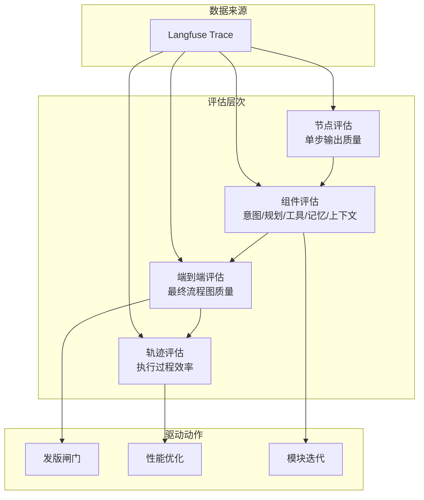

# 评估与可观测性

LLM 应用面临黑盒问题，必须可观测、可评估、可调试才能持续迭代。可观测性为评估提供数据基础（trace 记录每一步），评估为发版提供量化闸门（指标达标才发布）。

## 评估维度

| 维度 | 指标 | 判定方式 |
|------|------|---------|
| 结构维度 | 格式合规率（JSON Schema 校验通过率）、图结构完整性（节点准确率、边连接正确率、无孤立节点、是否无闭环、决策节点有无分支） | 脚本评分 |
| 语义维度 | 业务准确性（如"请假流程要经过部门主管审批"→ 图中是否有该节点、位置对不对） | 人工标注测试集 |
| 组件维度 | 意图识别准确率、CoT 规划准确率、记忆召回率、工具调用成功率 | 分阶段统计 |

## 发版标准（回归闸门）

::: danger 语图发版标准
固定用例集全量回归必须过闸门——

- **结构**：格式合规率 100%（JSON 不合法或偏离 schema 卡死，不可用门槛）；图结构完整性（节点数、边连接、无孤立节点）达标
- **语义**：业务准确性人工复核通过
- **组件**：意图识别准确率 ≥ 95%、记忆召回准确率 ≥ 95%、工具调用成功率 ≥ 98%（**任一跌破不发布**）
- **历史 Bad Case 零劣化**

上述指标均由全量回归跑出统计。
:::

## 可观测性：trace + 日志

::: tip 组成
① **trace 系统**——一轮会话的完整追踪，可看调用了哪些工具、使用了什么记忆、system prompt、项目上下文；② **日志系统**——内部更细节的记录。trace 负责快速定位问题，日志负责更详细分析哪一步出问题。
:::

### Langfuse

**平台**：Langfuse（LLM Engineering Platform：Tracing + Observability + Evaluation + Prompt Management），核心即可观测性。

Langfuse 核心功能：

| 功能 | 说明 |
|------|------|
| 追踪与调试 | 完整链路追踪：自动追踪用户输入（Prompt）、调用 LLM 的请求（模型名称、参数、Token 使用量）、中间步骤、输出（Response）及后续处理；可视化呈现复杂调用链 |
| 评估与分析 | 在 Trace 基础上，可手动或自动对 LLM 输出进行评分 |
| 监控性能与成本 | 跟踪请求延迟、Token 消耗、错误率、成本等指标 |
| 实验与迭代 | 支持 A/B 测试不同提示词、模型、参数或代码路径的效果 |

### Langfuse vs LangSmith

| 维度 | Langfuse | LangSmith |
|------|----------|-----------|
| 核心作用 | LLM 应用的可观测性、评估、调试和分析 | 相似 |
| 开源 | 开源 | 免费基础版仅 SaaS |
| 自托管 | 支持 | 仅企业版 |
| 生态绑定 | 框架无关 | LangChain 生态 |

### 埋点

通过 trace 记录意图识别、上下文组装、工具调用、生成与反思反馈全链路，支持以下分析：
- Prompt / 输入输出
- Token 消耗
- 模型延时
- 工具调用
- 异常信息

## 测试用例生成策略

| 策略 | 说明 | 优缺点 |
|------|------|--------|
| 手工写 | 覆盖核心流程 + 边界 | 最准但慢、覆盖窄 |
| 模型生成变体 | 核心 case 扩写出相似/模糊变体，快速铺量做 fuzz | 扩覆盖快，但要人工过一遍筛掉垃圾 |
| 生产回放 | 抓真实用户 query 当用例 | 长尾最真实 |

::: tip 模型生成变体示例
"电商下单" → 衍生出"带优惠券的电商下单""库存不足时的电商下单"。快速铺量做 fuzz 测试。
:::

## 轨迹评估（Trajectory Evaluation）

从 LLM 评测到 Agent 评测的范式跃迁——不只看最终输出，而是评估 Agent 完整执行轨迹。

::: tip 为什么需要轨迹评估？
只看最终输出会漏掉中间步骤的问题。比如 Agent 最终生成了正确的流程图，但中间调了 5 次工具、走了 3 次反思回路——这说明效率有问题。轨迹评估能发现这些隐藏问题。
:::

### 评估维度

轨迹评估关注的不是"结果对不对"，而是"过程好不好"：

| 维度 | 指标 | 说明 |
|------|------|------|
| 步骤效率 | 工具调用次数、反思回路次数 | 同样的结果，3 次调用优于 8 次调用 |
| 路径合理性 | 是否走了不必要的分支 | 比如先规划了 A 方案，执行一半发现不行又切到 B 方案 |
| 错误恢复能力 | 从错误到恢复的步数 | 工具调用失败后，Agent 多快能找到替代方案 |
| 上下文利用率 | 召回的记忆中有多少被实际使用 | 召回 10 条记忆但只用了 1 条，说明召回策略需要优化 |
| 终止条件 | 是否在合理步骤内完成 | 无限循环或超过最大步数说明规划或反思逻辑有问题 |

### 评估方法

**基于规则的自动评估**：设定阈值，如"工具调用次数 ≤ 5""反思回路 ≤ 2"，超出即标记为低效轨迹。适合做自动化监控和告警。

**基于对比的评估**：对同一输入，维护一组"黄金轨迹"（人工标注的最优执行路径），新版本的轨迹与黄金轨迹对比，偏离度过大则告警。

**基于 LLM 的评估**：让另一个模型（评估模型）审视完整轨迹，打分"这个 Agent 的执行过程是否高效合理"。成本较高，适合抽样评估而非全量。

### 在语图中的落地

语图通过 Langfuse trace 记录完整执行轨迹，每个节点的输入/输出、工具调用、反思结果都可追溯。基于这些数据：

- **日常监控**：统计每类意图的平均工具调用次数和反思次数，发现异常波动
- **发版对比**：新版本 vs 旧版本的轨迹效率对比，确认优化生效
- **问题定位**：某个 case 效果差时，直接看 trace 定位是 CoT 规划问题、记忆问题还是工具问题

::: tip 轨迹评估的价值
轨迹评估是从"LLM 评测"到"Agent 评测"的关键跃迁。LLM 评测看单次输入输出，Agent 评测看完整执行过程。对于多步骤、有状态、会调用工具的 Agent 系统，只看最终输出远远不够——过程质量决定了系统的可靠性、成本和用户体验。
:::

## 评估体系总结

四个评估层次从微观到宏观，覆盖了"单步质量→模块功能→最终产物→执行过程"的完整视角。所有评估数据统一来自 Langfuse trace，驱动发版决策、性能优化和模块迭代。

- 相关：[部署](./backend/deploy.md) · [质量属性](./engineering.md)
