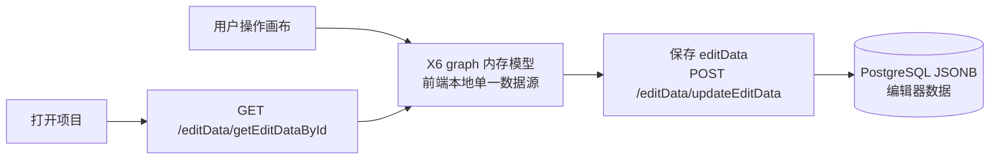

# 编辑器（AntV X6）

## 定位

编辑器的定位是**流程图编辑工具**：提供画布、节点增删改、连线、样式调整等开箱即用的编辑能力。编辑器**不做**实时数据对接——它只负责图形的编辑与持久化，不负责对接数据库实时状态。

## 画布能力

基于 AntV X6 提供的开箱即用图编辑能力，画布支持：

- 节点增删改（start / end / process / decision / io / subprocess 等类型）
- 连线（边）的创建与调整
- 样式调整（颜色、线型、标签）
- **undo / redo**（撤销 / 重做）

undo/redo 是编辑器的基础能力，保证用户在拖拉拽精修时的可回退性——AI 生成的流程图也支持在画布上做二次编辑，出错可一步撤销。

## 数据管理：前端本地 vs 后端

流程图编辑器面临两个层面：

1. **前端数据的增删改**：用户在画布上的每一次操作，前端本地如何记录（X6 的 graph 模型即内存中的单一数据源）。
2. **后端怎么管理数据**：编辑器数据（流程图文档）最终落在 **PostgreSQL**（JSONB 列），由 `editData` 模块保存，与项目/用户模块同库通过 `projectId` 关联。



##  导入导出模块

导入导出支持流程图数据的跨引擎格式转换：

- **导出**：把画布中的 X6 JSON 保存/下载。
- **导入**：用户上传本地的 X6 JSON 数据，由后端 `editData` 模块保存（落 PostgreSQL JSONB），与项目/用户模块同库关联。

> 资料原文：这个页面的功能是，用户上传本地的 X6 json 数据，由后端 editData 模块保存；后端会将 json 数据拆分成字段的形式存储；这一部分完全是公司的业务了，可以放一放后面做。

### X6 序列化数据结构示意

X6 序列化后的数据以 `cells` 数组承载节点与边，下面是一个包含两个节点一条边的精简结构：

```json
{
  "cells": [
    {
      "id": "edge-1",
      "shape": "edge",
      "attrs": {
        "line": {
          "stroke": "#A2B1C3",
          "targetMarker": { "name": "block", "width": 12, "height": 8 }
        }
      },
      "source": "node-1", "target": "node-2"
    },
    {
      "id": "node-1",
      "shape": "rect",
      "attrs": { "body": { "fill": "#fff" }, "label": { "text": "节点" } },
      "position": { "x": 40, "y": 40 }, "size": { "width": 120, "height": 40 }
    },
    {
      "id": "node-2",
      "shape": "rect",
      "attrs": { "body": { "fill": "#fff" }, "label": { "text": "节点2" } },
      "position": { "x": 40, "y": 120 }, "size": { "width": 120, "height": 40 }
    }
  ]
}
```

注意：AI 生成链路里**模型不生产这份结构**——模型只输出 `FlowDraft` 语义结构，坐标/样式/ports 由前端转换层补齐（见[前端](./index.md)）。X6 完整 JSON 的臃肿正是引入中间结构做 Token 优化的原因。

## 小结

| 关注点       | 方案                                            |
| ------------ | ----------------------------------------------- |
| 编辑引擎     | AntV X6（开箱即用，时间成本可控）               |
| 撤销重做     | X6 内置 undo/redo                               |
| 本地数据     | X6 graph 内存模型为单一数据源                   |
| 持久化       | PostgreSQL JSONB（editData 模块）                 |
| 导入导出     | 支持 X6 JSON 导入/导出，与后端 editData 互通      |
| 能力边界     | 不做实时数据对接，只负责图形编辑与持久化      |
