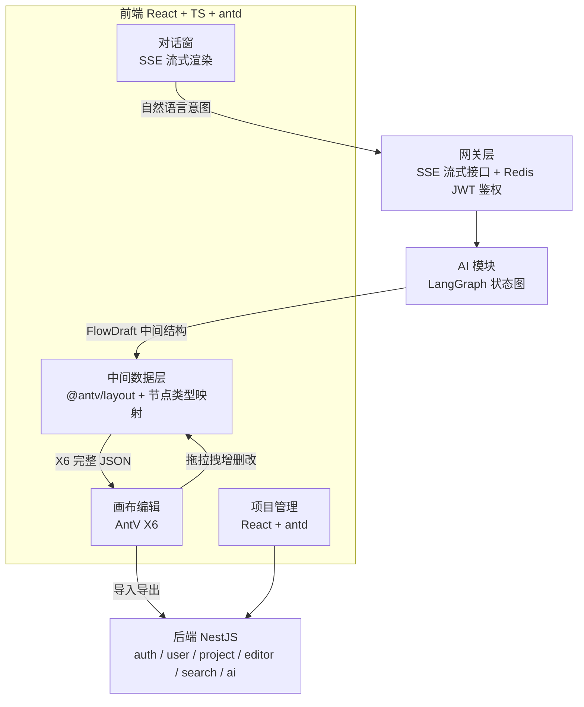
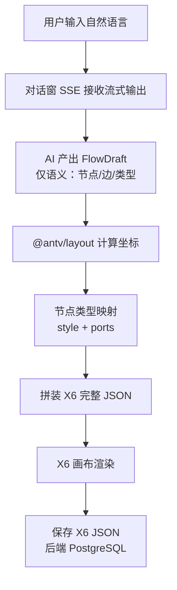

# 前端

语图的前端不是"调接口的壳"，而是整个产品里**确定性与模型解耦**的关键执行层：模型只负责"这张图该长什么样"（语义），前端负责"怎么画出来"（坐标、样式、连线、渲染）。

## 技术选型

| 模块      | 技术                | 职责                                                   |
| --------- | ------------------- | ------------------------------------------------------ |
| 应用框架  | React + TypeScript  | UI 组织、状态管理、组件化                              |
| UI 组件库 | antd                | 表单、弹窗、列表、项目管理的现成组件                   |
| 编辑引擎  | AntV X6             | 流程图编辑（undo/redo、节点增删改、连线、样式、导入导出）|
| 自动布局  | @antv/layout        | 层级布局算法计算节点坐标                               |
| 流式通信  | SSE（EventSource）  | 对话接口流式推送，逐 token 渲染 AI 思考与生成内容      |

##  四大前端模块

| 模块        | 技术                    | 说明                                                       |
| ----------- | ----------------------- | ---------------------------------------------------------- |
| 画布编辑    | AntV X6                 | 撤销/重做、节点增删改、连线、样式调整                       |
| 对话窗      | SSE 流式渲染            | 悬浮于画布右侧，逐步展示 AI 生成内容与思考过程             |
| 项目管理    | React + antd            | 项目列表、创建、删除、编辑，数据保存，跨项目记忆隔离       |

两种数据生成方式：
1. **拖拉拽**：用户在 X6 画布上手动创建和编辑流程图。
2. **AI 生成**：用户通过对话窗输入自然语言，AI 自动生成流程图（支持 generate / modify / consult 三种意图）。

##  确定性优先在前端的落地

贯穿整个产品的核心思想是 **「确定性程序 → 小模型 → 大模型」** 的分层降级。在前端这一层，最典型的表现是**中间数据结构（FlowDraft）**：

- 模型**不输出** X6 完整 JSON（坐标、样式、ports、zIndex），只输出描述流程语义的中间结构。
- 前端程序化地把中间结构转接为 X6 数据：**① @antv/layout 层级布局算法算坐标 → ② 节点类型映射表生成 style + ports → ③ 拼装注册到画布**。
- 坐标与样式全部交给确定性代码，模型输出越简单，出错空间越小。

```typescript
// 模型返回的中间结构（FlowDraft）—— 不含坐标、不含样式
interface FlowDraft {
  nodes: FlowNode[];
  edges: FlowEdge[];
}

interface FlowNode {
  id: string;       // 节点唯一 ID
  label: string;    // 显示文本
  type: NodeType;   // 节点类型（决定样式/ports 映射）
  // 注意：无 x/y，无 style，无 ports 定义
}

type NodeType = "start" | "end" | "process" | "decision" | "io" | "subprocess";

// 前端转换层：中间结构 -> X6 完整 JSON
// 1) @antv/layout 层级布局算法计算坐标
// 2) 节点类型映射表生成 style + ports
// 3) 拼装注册到画布
```

### 节点类型映射表

上面转换步骤 ② 用的映射表。`NodeType` → X6 节点配置（shape / size / attrs / ports），前端转换层查这张表为每个 `FlowNode` 生成对应的 X6 节点。

| NodeType | 形状 | 配色（antd 色板） | 默认尺寸 | Ports 方向 |
| --- | --- | --- | --- | --- |
| start | 椭圆 | 绿 `#52C41A` / `#389E0D` | 120×50 | bottom |
| end | 椭圆 | 红 `#F5222D` / `#CF1322` | 120×50 | top |
| process | 圆角矩形 | 蓝 `#1890FF` / `#096DD9` | 140×50 | top / right / bottom / left |
| decision | 菱形（polygon） | 橙 `#FAAD14` / `#D48806` | 140×80 | top / right / bottom / left |
| io | 平行四边形（polygon） | 紫 `#722ED1` / `#531DAB` | 140×50 | top / bottom |
| subprocess | 圆角矩形（双线框） | 青 `#13C2C2` / `#08979C` | 140×50 | top / right / bottom / left |

```typescript
// 端口组定义：四个方向各一个连接磁吸点
const PORT_GROUPS = {
  top:    { position: 'top',    attrs: { circle: { r: 3, magnet: true, fill: '#fff', stroke: '#5b8ffa' } } },
  right:  { position: 'right',  attrs: { circle: { r: 3, magnet: true, fill: '#fff', stroke: '#5b8ffa' } } },
  bottom: { position: 'bottom', attrs: { circle: { r: 3, magnet: true, fill: '#fff', stroke: '#5b8ffa' } } },
  left:   { position: 'left',   attrs: { circle: { r: 3, magnet: true, fill: '#fff', stroke: '#5b8ffa' } } },
};

// 节点类型 → X6 节点配置映射表
const NODE_TYPE_CONFIG: Record<NodeType, {
  shape: string;
  width: number;
  height: number;
  fill: string;
  stroke: string;
  radius?: number;
  refPoints?: string;       // polygon 顶点，用于菱形 / 平行四边形
  strokeWidth?: number;
  portItems: string[];      // 启用哪些方向的 port
}> = {
  start: {
    shape: 'ellipse',
    width: 120, height: 50,
    fill: '#52C41A', stroke: '#389E0D',
    portItems: ['bottom'],
  },
  end: {
    shape: 'ellipse',
    width: 120, height: 50,
    fill: '#F5222D', stroke: '#CF1322',
    portItems: ['top'],
  },
  process: {
    shape: 'rect',
    width: 140, height: 50,
    fill: '#1890FF', stroke: '#096DD9', radius: 8,
    portItems: ['top', 'right', 'bottom', 'left'],
  },
  decision: {
    shape: 'polygon',
    width: 140, height: 80,
    fill: '#FAAD14', stroke: '#D48806',
    refPoints: '0,40 70,0 140,40 70,80',  // 菱形顶点
    portItems: ['top', 'right', 'bottom', 'left'],
  },
  io: {
    shape: 'polygon',
    width: 140, height: 50,
    fill: '#722ED1', stroke: '#531DAB',
    refPoints: '20,0 140,0 120,50 0,50',  // 平行四边形顶点
    portItems: ['top', 'bottom'],
  },
  subprocess: {
    shape: 'rect',
    width: 140, height: 50,
    fill: '#13C2C2', stroke: '#08979C', radius: 8, strokeWidth: 2,
    portItems: ['top', 'right', 'bottom', 'left'],
  },
};

// 转换函数：FlowNode + 映射表 → X6 节点配置
function toX6Node(node: FlowNode, x: number, y: number) {
  const cfg = NODE_TYPE_CONFIG[node.type];
  return {
    id: node.id,
    shape: cfg.shape,
    position: { x, y },
    size: { width: cfg.width, height: cfg.height },
    attrs: {
      body: {
        fill: cfg.fill,
        stroke: cfg.stroke,
        radius: cfg.radius,
        refPoints: cfg.refPoints,
        strokeWidth: cfg.strokeWidth ?? 1,
      },
      label: { text: node.label, fill: '#fff', fontSize: 14 },
    },
    ports: {
      groups: PORT_GROUPS,
      items: cfg.portItems.map(dir => ({ group: dir, id: `port-${dir}` })),
    },
  };
}
```

::: tip 为什么 start / end 只给 1-2 个 port
start 是流程起点，只往外连线（bottom）；end 是终点，只往里连线（top）。多余 port 会让布局算法产生跨层连线，降低可读性。decision / process / subprocess 给全 4 向 port，因为它们是分支和汇聚的枢纽。
:::

### Token 优化（前端视角）

中间结构的引入同时是前端渲染稳定性的关键，也是 Token 优化的关键：

| 阶段       | 方案                  | 输出内容                                 | Token 消耗        |
| ---------- | --------------------- | ---------------------------------------- | ----------------- |
| 早期       | 直接输出 X6 完整 JSON | 坐标、样式、ports、zIndex 全部由模型生成 | ~2000             |
| 第一次优化 | 引入中间表示层        | 模型只输出流程语义结构                   | ~600-700（1/3）   |
| modify 注入 | 完整 FlowDraft（带 ID） | 带节点/边 ID 支撑增量 diff（不再降级为摘要，摘要会破坏 ID 匹配前提） | ~600-700          |

X6 完整 JSON 有多臃肿？一个简单的 2 节点 1 边图，X6 序列化后约 500 行 JSON，其中每个节点约 20 个 port 定义、坐标、样式细节——这些在前端转换层由确定性代码生成，不需要模型操心。

## 前端模块结构图



## 端到端数据流（前端视角）



::: warning 编辑器的能力边界
编辑器的定位是流程图编辑工具：提供画布编辑、节点增删改、连线、样式调整等能力，并负责图形的持久化。编辑器**不做**实时数据对接——不负责对接数据库实时状态、不负责展示实时数据是否正常。图形编辑与数据展示是两个独立的职责。
:::

## Modify 场景的前端处理（新增）

> 本节为 modify 增量 patch 方案的前端落地说明，与上方 generate 流程并行阅读。

modify 场景下，AI 返回的数据结构不再是 FlowDraft（完整节点/边数组），而是 `ModifyPatchOutput`（增量操作序列）。前端需要新增一套 patch 应用逻辑，与 generate 的全量渲染并行存在。

### 两种数据结构对比

| 场景 | 数据结构 | 前端处理 | 画布行为 |
|------|---------|---------|---------|
| generate | `FlowDraft { nodes[], edges[] }` | layout → 映射 → 全量渲染 | 替换整个画布 |
| modify | `ModifyPatchOutput { operations[] }` | 逐条应用 patch | 增量更新现有画布 |

### 操作类型与 X6 API 映射

前端收到 `ModifyPatchOutput` 后，按 operation 类型调用对应的 X6 API：

```typescript
function applyPatch(graph: Graph, patch: ModifyPatchOutput) {
  for (const op of patch.operations) {
    switch (op.op) {
      case 'modify_node': {
        const node = findNodeByTarget(graph, op.target);
        if (op.semantic?.label) node.setAttrs({ label: { text: op.semantic.label } });
        if (op.visual) applyNodeVisual(node, op.visual);
        break;
      }
      case 'add_node': {
        const pos = calcRelativePosition(op.position, graph);
        const node = toX6Node(op.semantic, pos.x, pos.y);
        graph.addNode(node);
        break;
      }
      case 'delete_node': {
        const node = findNodeByTarget(graph, op.target);
        graph.removeCell(node); // 级联删除关联边
        break;
      }
      case 'add_edge': {
        const source = graph.getNodeByLabel(op.semantic.source.label);
        const target = graph.getNodeByLabel(op.semantic.target.label);
        graph.addEdge({ source: source.id, target: target.id, label: op.semantic.label });
        break;
      }
      case 'delete_edge': {
        const edge = findEdgeByTarget(graph, op.target);
        graph.removeCell(edge);
        break;
      }
      case 'modify_edge': {
        const edge = findEdgeByTarget(graph, op.target);
        if (op.semantic?.label) edge.setLabels([{ attrs: { label: { text: op.semantic.label } } }]);
        if (op.visual) applyEdgeVisual(edge, op.visual);
        break;
      }
      case 'reposition': {
        const node = findNodeByTarget(graph, op.target);
        const pos = calcRelativePosition(op.position, graph);
        node.setPosition(pos.x, pos.y);
        break;
      }
    }
  }
}
```

### 视觉 patch 到 X6 attrs 的映射

`NodeVisualPatch` 中的高层语义字段（`fillColor`、`borderColor` 等）需要映射为 X6 的 attrs 路径：

```typescript
function applyNodeVisual(node: Node, visual: NodeVisualPatch) {
  const attrs: Record<string, unknown> = {};
  if (visual.fillColor)    attrs.body = { ...attrs.body, fill: visual.fillColor };
  if (visual.borderColor)  attrs.body = { ...attrs.body, stroke: visual.borderColor };
  if (visual.borderWidth)  attrs.body = { ...attrs.body, strokeWidth: visual.borderWidth };
  if (visual.borderStyle === 'dashed') attrs.body = { ...attrs.body, strokeDasharray: '5 5' };
  if (visual.fontColor)    attrs.label = { ...attrs.label, fill: visual.fontColor };
  if (visual.fontSize)     attrs.label = { ...attrs.label, fontSize: visual.fontSize };
  if (visual.fontWeight)   attrs.label = { ...attrs.label, fontWeight: visual.fontWeight };
  node.setAttrs(attrs);
}
```

::: tip 关键区别
generate 场景前端拿到 FlowDraft 后走 layout → 映射 → 全量渲染，画布被替换。modify 场景前端拿到 ModifyPatchOutput 后逐条应用 patch，**画布上未被 patch 涉及的节点保持原样**——包括用户手动调整的坐标与样式。
:::

##  相关页面

- [编辑器（AntV X6）](./editor.md)：画布能力、undo/redo、数据管理、导入导出
- [登录鉴权](../backend/auth.md)：表单、头像、token 携带、JWT 校验
