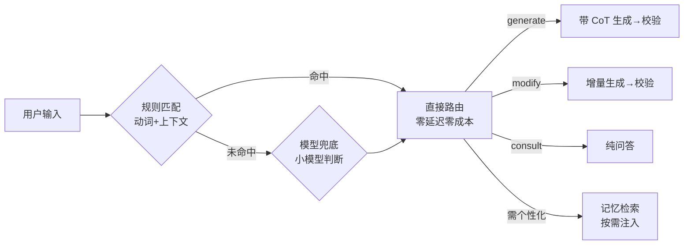

# 意图识别

::: tip 定义
意图识别是 Agent 的**路由开关**，职责是用最小成本决定走哪条工作流、以及是否触发个性化记忆检索——**语义理解不在这里做**。
:::

## 意图分类

| 意图 | 行为 | 示例 |
|------|------|------|
| `generate` | 走带 CoT 的语义生成→校验 | "生成请假流程" |
| `modify` | 带画布数据做**增量生成** | "把审批节点改红色" |
| `consult` | 纯问答，**不输出 JSON** | "为什么这样设计？" |

## 规则 + 模型兜底

意图识别采用**确定性优先**的两级策略：

### 第一级：规则分类（成本最低）

**动词特征 + 上下文状态**：

- 动词特征："生成/画/创建"→generate；"改/加/删除"→modify；"为什么/怎么"→consult
- 上下文状态：是否已有画布、是否选中节点

示例：
- "生成请假流程" → 命中 generate（动词"生成"）
- "把审批节点改红色" → 命中 modify（动词"改" + 已有画布）

规则命中时**零延迟、零成本**直接走对应工作流。

### 第二级：模型兜底

规则覆盖不到的情况再让模型判断：
- 无动词特征
- 歧义表达
- 多命中（同时匹配多个意图）

::: warning 为什么不用模型直接分类？
意图识别是高频必经节点，用规则 + 低成本模型即可覆盖绝大多数情况，仅在边界交给模型兜底，把高级模型算力留给真正的推理与生成，显著降本且延迟更低。

架构认知不靠"报菜名"体现，靠"取舍"体现。不是"我用了模型做意图识别"，而是"为什么用规则而不是模型、规则覆盖不到时才调模型、怎么降本"。
:::

## 与记忆检索的联动

意图识别同时决定**是否触发个性化记忆检索**：当判断需要个性化辅助时，才向 PostgresStore 拉取相关画像标签动态注入（非全量、非每次调用）。

这是"按需检索、动态注入"策略，避免无谓的 token 消耗与注意力分散。

### 需要触发记忆检索的场景

- `generate`：需要参考历史项目记忆和用户偏好
- `modify`：需要当前画布上下文 + 历史记忆
- `consult`：需要历史对话记忆来回答问题

### 不需要全量画像注入的场景

- 事实性问答
- 指令明确的简单修改
- 多轮对话的连续上下文（意图在短期记忆中已清晰）

## 意图识别的工程价值

意图识别在整个 Agent 链路中承担"交通管制"的角色：

通过规则前置，绝大多数请求不需要调用模型就能完成路由，既节省了成本，又降低了延迟。这是"确定性程序优先"原则在路由层的直接体现。
