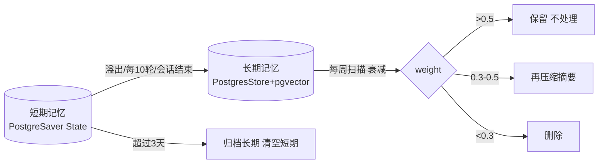

# 记忆管理

记忆管理分为**短期记忆、长期记忆、用户画像**三个子模块，覆盖"写入 → 压缩 → 召回 → 遗忘"全生命周期。约束条件始终是：**存储成本、召回成本、注意力成本**。

::: tip 核心认知
记忆模块是一个需要全生命周期管理的模块——写入、压缩、召回、遗忘，整个流程需要管理起来。如何存：存的时候如何保证不漏数据？更新时得考虑性能问题。如何取：取的时候要考虑节省 token，节省注意力。
:::

## 分层架构

| 类型 | 载体 | 生命周期 | 内容 |
|------|------|---------|------|
| 短期记忆 | LangGraph Checkpointer（PostgreSaver） | 跟随当前对话；结束清空；>3 天归档长期 | 每轮结构化提取（意图/实体/话题 ID）后的 State |
| 长期记忆 | LangGraph Store（PostgresStore + pgvector） | 跟随用户，跨项目 | 摘要 + 向量 + 关键词索引 + sessionEntitySlot + 元数据 |
| 用户画像 | PostgresStore（独立命名空间，JSON） | 长期，异步更新 | 基本信息/偏好/交互风格/职业背景等稳定特征 |

### 金字塔类比

- **短期记忆** = 流水（当前对话上下文）
- **长期记忆** = 水库（历史交互的具体事件和事实）
- **用户画像** = 水质报告（对水库水质的整体评估和特征总结）

## 存储与更新

### 短期记忆

进入 PostgreSaver 的会话，元数据先打 `isSummarized=false`；每够 2 轮做一次摘要写入 `rollingSummary` 变量，对应标记 `isSummary=true`。

短期记忆存储的是**结构化 JSON**（非原始字符串，非 Embedding 向量），包含原文 + 轻量特征提取结果：

```typescript
interface TurnRecord {
  turnId: number;
  role: 'user' | 'assistant';
  content: string;          // 原文保持，拼 prompt 时直接取出来用
  timestamp: string;
  intent?: string;          // 轻量特征提取：意图
  entities?: Record<string, unknown>;  // 实体槽位
  topicId?: string;         // 话题 ID，用于漂移检测
}
```

::: warning 为什么短期记忆不做 Embedding？
短期记忆是给 LLM 直接消费的，不是给检索系统做相似度计算的。Redis/Checkpointer 里存人能读懂的结构化文本，向量库里才存向量。两者职责不同。
:::

### 长期记忆

短期记忆溢出后，**每 10 轮或用户结束对话**，由节点**异步写入** Store，数据含：摘要 + 向量 + 关键字索引 + sessionEntitySlot + 元数据。

长期记忆采用**向量 + 摘要双储存**策略：

```typescript
interface LongTermMemory {
  summary: string;                 // 摘要文本（召回后给 LLM 看）
  vector: number[];                // pgvector 嵌入（BGE-M3，1024维）
  keywords: string[];              // 关键词索引
  sessionEntitySlot: Record<string, unknown>; // 精确实体，避免压缩丢失
  metadata: {
    sessionId: string;
    isSummarized: boolean;         // 未压缩的原始记忆也要召回
    topics: string[];
    timestamp: string;
  };
}
```

压缩流水线：

1. 把对话按主题切分成若干块
2. LLM 生成每块摘要
3. BGE-M3 编码成向量（1024 维，`normalize_embeddings=True`）
4. 存入 PostgresStore（向量 + 摘要 + 元数据）

### 用户画像

借助模型从记忆中提炼稳定特征，以 JSON 文档独立维护。

**调用时机**——意图识别判断需要个性化辅助时才按需检索注入（非全量、非每次调用）。

**更新时机**——会话结束后异步触发（Session-based Update，性价比最高）。

::: warning 为什么不能每次对话都更新画像？
1. **成本爆炸**：每次都要调用大模型进行信息抽取
2. **价值稀释**：大多数日常对话不包含能刻画用户长期特征的有效信息
3. **画像抖动**：用户可能随口表达一个临时偏好（如"今天不想吃辣"），立即更新会污染长期画像数据
:::

画像更新内部逻辑（伪代码）：

```python
def update_user_profile(user_id, conversation_text):
    # 1. 获取现有画像
    current_profile = db.get_profile(user_id)
    # 2. 调用大模型进行信息抽取
    prompt = f"""
    以下是用户与助手的对话记录。请分析对话，提取用户的长期稳定特征。
    只提取确定性的偏好，忽略临时性需求。
    现有用户画像：{current_profile}
    对话记录：{conversation_text}
    请以JSON格式输出需要新增或修改的字段。如果没有有价值的信息，返回空JSON {{}}。
    """
    extracted_json = llm.invoke(prompt)
    if extracted_json == {}:
        return "No update needed"
    # 3. 冲突消解与合并
    merged_profile = deep_merge(current_profile, extracted_json)
    # 4. 写入数据库
    db.update_profile(user_id, merged_profile)
    # 5. 记录更新日志
    log_update(user_id, extracted_json)
```

## 遗忘策略（确定性衰减）

采用指数衰减函数，半衰期按访问次数动态调整；**每周扫描**一次：

```typescript
weight = exp(-0.693 * daysSinceLastAccess / halfLife)

// 每周扫描：
//   weight > 0.5         -> 不处理
//   0.3 <= weight <= 0.5 -> 对摘要再做一次压缩
//   weight < 0.3         -> 删除
```

::: tip 为什么用确定性衰减而不是让模型判断？
纯数学计算，不需要模型判断"这条记忆该不该忘"。省 token、省成本、可预测。遗忘策略是确定性优先原则的典型体现。
:::

### 用户画像标签的冷热衰减

- **热标签（近期偏好）**：如"最近在关注买房"。权重高，更新较频繁，但衰减快（1 个月不提就降权）
- **冷标签（固有属性）**：如"职业是程序员"。一旦确立，几乎不更新，也不衰减

## 召回策略



### 短期召回

`trim_messages` 取最近 3 轮，结合（向量相似度 + 时效性 + 话题一致性）判断是否够用；够用则不再召回长期。

::: tip 评估后召回 vs 直接召回
- **评估后召回**：90% 的请求只需走"评估"+"短期记忆"路径，成本极低；10% 的请求才触发昂贵的长期检索
- **直接召回**：100% 的请求都需要支付"长期记忆检索"的成本

"够不够"的判断是代码做的，不是模型做的——结合向量相似度 + 时效性 + 话题一致性。
:::

### 长期召回

向量 + 关键词**双路召回**，**RRF 融合排序**取 top 10，**Reranker 模型**重排取最高 3 条摘要入上下文。

召回流程：

1. **向量检索**：当前用户输入 → BGE-M3 编码 → pgvector 相似度检索 top-K
2. **关键词检索**：从用户输入提取关键词 → BM25/关键词索引检索 top-K
3. **RRF 融合**：两路结果按 Reciprocal Rank Fusion 公式合并排序，取 top 10
4. **Reranker 重排**：用 Reranker 模型对 top 10 做精排，取最高 3 条
5. **组装上下文**：按固定模板包装为纯文本段落

### 实体保真

若摘要涉及结构化实体（审批金额、电话等），用元数据 id 找 `sessionEntitySlot`，再按关键词取精确实体数据，避免摘要压缩导致的关键数值丢失。

::: warning 结构化实体不丢失
摘要是有损压缩，倾向保留语义而丢弃精确细节。ID、电话、金额等实体必须"分离存储、混合检索"——语义层可压缩，事实/实体层只索引不可压缩。

**黄金法则**：把 Agent 记忆压缩当作"数据库归档"而不是"文章缩写"来处理。能结构化的，绝不放进自然语言摘要里。压缩的对象是"叙事"，不是"事实"。
:::

### 未压缩记忆

Store 中 `isSummarized=false` 的原始记忆同样参与召回——不是所有记忆都需要先压缩再存储，未压缩的原始记忆在需要时也可以被检索到。

## 话题切换检测

多轮对话中用户可能突然跳到另一个话题，历史记忆污染当前上下文。系统通过**基于 Embedding 相似度的 topic shift 检测**解决：

```typescript
function detectTopicShift(messages: Message[]): boolean {
  if (messages.length < 4) return false;
  const recentVectors = messages.slice(-3).map(msg => getVector(msg.content));
  const earlierVectors = messages.slice(-6, -3).map(msg => getVector(msg.content));
  const similarity = calculateAverageSimilarity(recentVectors, earlierVectors);
  return similarity < 0.5; // 相似度低于阈值，认为话题发生变化
}
```

### 三种检测方案

| 方案 | 原理 | 适用场景 |
|------|------|---------|
| 意图与槽位继承 | 意图相同或槽位复用 → 同一 Topic ID | 任务型对话（推荐） |
| 规则触发词 | 命中"对了""换个话题"等触发词 → 新 Topic ID | 轻量级兜底 |
| LLM 实时归类 | 小模型判断是否继续上一个话题 | 复杂场景终极方案 |

::: tip 性能优势
在写入时就打好 Topic 标签，检索时直接比对字段——O(1) 的 Hash 比对 vs O(N) 的向量计算。这是工业界处理多轮对话最标准、最高效的做法。
:::

## Token 预算与注意力管理

### 用户画像的 Token 成本

用户画像约 2KB 数据（约 500 token），每次请求都拼接会导致额外的 Token 消耗和注意力分散。因此采用**按需检索、动态注入**策略：

**不需要注入画像的场景**：
- 事实性问答（如"今天天气怎么样"）
- 指令明确的简单任务
- 多轮对话的连续上下文（意图在短期记忆中已清晰）

**需要动态注入画像的场景**：
- 个性化推荐与决策
- 风格调整
- 实体指代消解
- 主动关怀与提醒

### 记忆注入 Prompt 模板

```text
[当前上下文 - lastK]
对话消息:
1. 加一个审批节点A
2. 把它连到节点B
3. 把节点A颜色改为红色

项目摘要 (summary):
- 用户正在绘制采购流程图，目前已完成申请阶段，正在设计审批阶段。

相关历史 (vector search):
- 请假流程审批链条：员工 -> 部门经理 -> 人事 -> 总经理
- 上次采购流程审批讨论：需要引入供应商审批人
```

## 记忆生命周期管理

完整的记忆生命周期分为四层：

| 层级 | 职责 | 类比 |
|------|------|------|
| 写入层 | 语义分块、去重、摘要生成、任务边界识别 | 图书管理员给新书分类、去重、写摘要 |
| 组织层 | 结构化目录、用户画像、事件时间线、任务-子任务层级映射 | 建立图书馆的索引系统 |
| 检索层 | 关键词匹配、语义检索、文件导航、重排策略与 token 预算控制 | 读者查找资料 |
| 更新层 | 版本链、冲突消解、过期归档而非删除、权限管控与审计 | 图书馆的书籍更新和淘汰机制 |

### 性能优化技巧

- **冷热分离**：高频访问的短期记忆驻留内存（Redis/Checkpointer），长期记忆持久化到数据库
- **批量写入**：中长期记忆采用异步批量提交，减轻数据库压力
- **索引优化**：对 `user_id + timestamp` 建立复合索引，加速按用户和时间的查询
- **分级缓存**：构建多级缓存（如本地缓存 → Redis → 数据库），平衡速度与成本
