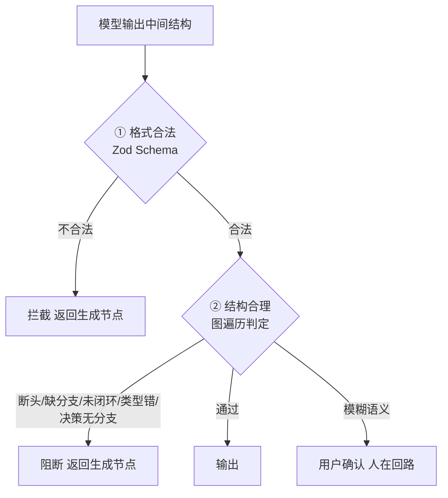
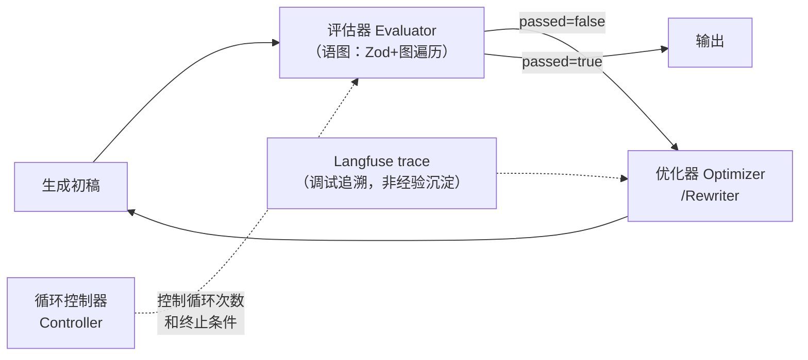

# 反思与反馈

生成结果经**两层确定性校验**，全部由代码完成，模型只在"模糊语义"环节介入。

## 两层校验流程

### ① 格式合法性

模型原生结构化输出（JSON mode）从源头约束结构，**Zod Schema 兜底校验**，JSON 不合法直接拦下。

::: tip 为什么用 Zod？
Qwen 偶尔会在 JSON 前面加一段解释文字，或者输出的 JSON 里节点 ID 重复。靠 System Prompt 约束不够，用 Zod Schema 校验兜底。引入中间表示层后这个问题缓解很多——语义结构比 X6 JSON 简单，模型出错空间本身就小。
:::

对于 modify 场景，Zod 的校验范围从 FlowDraft 的格式合法性扩展到 patch 的字段级语义约束。具体来说，modify 的 Zod Schema 除了验证 JSON 结构完整，还覆盖三类字段级校验：枚举值约束（`nodeType` 必须在 `start | end | process | decision | io | subprocess` 范围内，`borderStyle` 必须在 `solid | dashed | dotted` 范围内）、目标存在性校验（`target.label` 必须引用当前画布中实际存在的节点，防止模型幻觉出不存在的元素）、值域限制（`borderWidth` 限定 1-5 的整数，`fontSize` 限定离散字号）。校验失败时，错误信息精确到具体字段和 operation 索引（如"operations[0].visual.fillColor: 不是合法的 hex 颜色值"），供 Rewriter 做定向修正，无需重新生成整个 patch。

### ② 结构合理性

图遍历**确定性判定**：
- 断头节点（无下游连接）
- 缺下游分支
- 未闭环
- 节点类型错误
- 决策节点无分支

命中即阻断，返回生成节点附失败原因做局部修正。

## 问题分级处理

| 问题层级 | 处理方式 | 是否重走 Agent |
|---------|---------|:-------------:|
| 格式 / 结构问题 | 返回生成节点，附失败原因做局部修正 | 否（结果修正） |
| 模糊语义 | 交用户确认（人在回路），不盲改 | — |

### 结果修正

格式或结构类问题不需要重新走完整 Agent 主流程。反思层拿到校验失败信息后，将失败原因（如"节点 `N3` 为断头节点，缺少下游连接"）作为上下文注入生成节点，走 Rewriter 做局部修正——只改这一步的输出结果，不重走意图识别、上下文组装、工具调用等前置环节。成本低、速度快。

## 反思与反馈层架构

一个完整的反思与反馈层由四个核心模块构成，语图的映射如下：

### 评估器（Evaluator）

语图的评估器**不用 LLM 做判断**，而是用确定性代码——Zod Schema 校验格式、图遍历校验结构。这属于"外部反馈（工具验证）"模式：将输出结果交给确定性规则验证，而非让模型自我评价。

::: tip 为什么不用 LLM 做评估？
LLM 自评（单步反思）容易受自身偏差影响——模型倾向于认为自己输出是对的。两步式反思（让另一个模型评审）能缓解但增加成本。语图选择确定性代码校验：格式对不对 Zod 说了算，结构合不合法图遍历说了算，零幻觉、零额外 Token、可预测。
:::

### 优化器（Optimizer / Rewriter）

基于以下输入上下文生成新答案，**不需要重新走 Agent 的完整主流程**：
1. 原始用户问题
2. 当前步骤的初稿输出
3. 评估器给出的结构化反馈（`passed=false, category=xxx, message=xxx`）

### 循环控制器（Controller）

控制反思-修正循环的执行次数和终止条件，防止无限循环烧 token。

## human-in-the-loop

当校验遇到**模糊语义**（无法用确定性规则判断对错）时，系统不盲改，而是交用户确认。

::: warning 为什么不盲改？
模糊语义意味着模型不确定、代码也无法确定。如果系统自行猜测并修改，可能改出用户不想要的结果，反而比不改更糟糕。交用户确认是最安全的选择——"人在回路"是可靠性的最后一道防线。
:::
