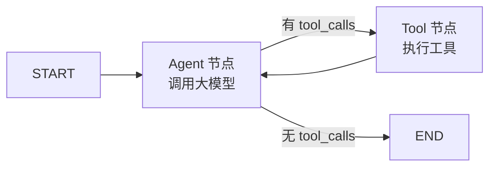

# 工具调用

RAG / Function Call / MCP / Skill 在本系统中被统一抽象为**提示词工程 + 适配层**：本质都是"把外部能力以结构化方式暴露给模型"。

::: tip 本质认知
RAG、Function Call、MCP 都是广义上的提示词工程——调用外部数据，然后将外部数据和用户提问结合起来发送给大模型。RAG 是从知识库获取数据，Function Call 是大模型具备调用外部数据的能力，MCP 在 Function Call 基础上制定了调用外部数据的标准，支持了上下文管理。
:::

## 工具形态

::: tip Skill 是什么
语图中的 "Skill" 指客户端侧的轻量工具——用 Markdown 描述工具名称/用途/参数，前端表单配置，后端动态注册到 ToolNode。与 MCP 的区别：Skill 依附于客户端、创建成本低（Markdown 即可），MCP 是独立外部服务、需提供完整 schema。语图内置的 TemplateMatcher 就是一个 Skill。
:::

| 形态 | 定位 | 本系统用法 | 上下文管理 |
|------|------|-----------|:----------:|
| Function Call | 模型原生工具调用 | 内置工具定义，结构化参数 | 无原生支持 |
| Skill | 轻量、用户可扩展 | TemplateMatcher（模板匹配）；用户自定义 Skill 前端表单配置 | 渐进式加载 |
| MCP | 独立外部服务 | 标准协议接入外部工具（JSON-RPC 2.0） | 支持 context_id |
| RAG | 知识检索 | 模板/规范/历史片段向量召回后注入上下文 | — |

### Skill vs MCP 对比

| 维度 | Skill | MCP |
|------|-------|-----|
| 轻量化程度 | 更轻量化、创建成本更低 | 门槛较高 |
| 加载方式 | 渐进式加载，只把描述清单放到 context 中，节省 token | 需提供 schema json |
| 创建方式 | 可以用 Markdown 创建 | 要提供 schema json |
| 独立性 | 依附于客户端 | 更加独立，是外部系统对大模型暴露的接口 |

## 内置 Skill：TemplateMatcher

- 用户说"画一个标准的请假流程"→ 模型调用 TemplateMatcher 命中模板**直接返回**，不从零生成
- 用户说"画请假流程，外包和正式员工分开审批"→ 模型判断有**定制需求**，跳过模板走正常生成

**可配置化**：工具定义（名称/描述/参数 Schema/执行器）配置化，用户经前端表单配置，后端**动态注册**到 LangGraph 的 ToolNode。

```typescript
// 工具字典：将模型给的字符串名字映射到真实函数
const TOOL_MAP = {
  "template_matcher": templateMatcherFunc,
  "search_template": searchTemplateFunc,
};

// 工具的 JSON Schema 定义（告诉模型有哪些工具可用）
const TOOLS_SCHEMA = [
  {
    type: "function",
    function: {
      name: "template_matcher",
      description: "匹配标准流程图模板，命中则直接返回",
      parameters: {
        type: "object",
        properties: {
          description: { type: "string", description: "流程描述" }
        },
        required: ["description"]
      }
    }
  }
];
```

## ToolNode 适配层

以 LangGraph `ToolNode` 作为工具调用的**适配器/中间件**：封装调用、结果归一化、错误结构化与重试/降级。所有工具经统一出口，便于观测与治理。

### 状态图中的工具调用流转



LangGraph 没有把工具调用黑盒化，而是将工具执行的权力交还给了开发者：

1. **Agent Node（大脑节点）**：调用大模型，决定是否调用工具。如果调用，输出包含 `tool_calls` 的 `AIMessage`
2. **Conditional Edge（条件边）**：检查 `AIMessage`，有 `tool_calls` 路由到 Tool Node，没有则路由到 END
3. **Tool Node（工具节点）**：执行工具，返回 `ToolMessage`

### ToolNode 替开发者完成的"引擎级"工作

1. **消息解析**：自动检查 `MessagesState` 中最后一条 `AIMessage` 的 `tool_calls`
2. **函数查找与映射**：通过工具名字典映射到实际函数
3. **参数反序列化**：将模型生成的 JSON 字串参数反序列化为字典
4. **并行执行**：模型一次回复中输出多个 `tool_calls` 时，自动并发执行
5. **结果封装**：统一封装为 `ToolMessage` 返回给状态

### LangGraph 工具机制的三大优势

- **白盒控制**：工具是显式的图节点，可随时在工具节点前后插入日志、鉴权、人工审批
- **并行执行**：多个 `tool_calls` 自动并发
- **容错定制**：通过自定义节点实现"异常翻译器"，确保模型永远收到干净、结构化的反馈

## 失败分类与降级（确定性处理）

工具失败**绝不把原始错误直接丢给模型**，而是先转为**结构化错误**：

```typescript
interface ToolError {
  status: 'error';
  error_type: 'network' | 'param' | 'fail';
  message_for_llm: string;   // 给模型看的明确修正提示
  suggestion: string;
}
```

### 为什么不能把原始报错丢给 Agent？

1. **幻觉误导**：模型有"强行解释"倾向，面对不理解的堆栈会"脑补"错误原因
2. **Token 浪费**：原始堆栈信息占用大量上下文窗口
3. **安全泄露**：堆栈中可能包含数据库连接字符串、内部 IP、文件路径等敏感信息
4. **死循环陷阱**：模型可能反复尝试修复，陷入无限重试

### 失败分类处理

| 错误类型 | 处理方式 | 执行者 |
|---------|---------|:------:|
| 网络类（超时、5xx） | 代码重试，指数退避，最多 3 次 | 代码 |
| 参数类（格式错、缺字段） | 错误信息拼成明确修正提示返回模型，让其自修正后重试，最多 3 次 | 模型 |
| 重试仍失败 | 走降级——System Prompt 引导模型自行判断 | 模型 |

### 降级策略

重试仍失败时，通过 System Prompt 引导模型自行判断：

- 是唯一数据来源 → 如实告知用户
- 后续工具依赖本次结果 → 提示中断
- 有历史记忆 → 基于历史作答但标注"可能非最新"

::: tip 工具引擎的统一出口
上述重试、错误结构化、降级逻辑全部封装在自定义 ToolNode 内（TypeScript 实现），不暴露给 Agent 节点。Agent 只看到干净的 `ToolMessage`——成功返回结构化数据，失败返回结构化错误 + 修正提示。审计日志、权限校验、限流控制都在 ToolNode 内完成，是"白盒控制"原则的直接体现。
:::

## 上下文与结果截断

### context_id

工具侧维护多轮上下文标识，支持多轮工具调用状态保持。MCP 协议原生支持 `context_id`：

```json
{
  "context_id": "ctx_20250618_001",
  "version": 3,
  "messages": [...],
  "tool_call_history": [...],
  "system_state": { "model": "gpt-4", "user_preference": {"language": "中文"} }
}
```

上下文截断策略：保留最近 10 条消息，丢弃旧记录，版本号递增。

### 结果封顶

top-K（数量截断）+ 字段截断（大小截断），防止大结果灌爆上下文：

- **top-K 管"几条"**：对结果按相关性打分，降序排列，只切前 K 条（如 top-5），第 6 名往后不进 context
- **字段截断管"每条多大"**：白名单过滤，只保留 `name`、`phone`、`id` 等关键字段

```typescript
// 策略1：结构化截断与采样
function truncateResult(data: unknown): unknown {
  if (Array.isArray(data)) {
    return data.slice(0, 5); // 只保留前5个
  }
  if (typeof data === 'string' && data.length > 2000) {
    return data.slice(0, 1000) + '\n...[内容已截断]...\n' + data.slice(-500);
  }
  return data;
}

// 策略2：基于 Key-Value 的过滤（白名单）
const WHITELIST = ['name', 'phone', 'id'];
function filterFields(raw: Record<string, unknown>): Record<string, unknown> {
  return Object.fromEntries(
    Object.entries(raw).filter(([k]) => WHITELIST.includes(k))
  );
}
```

## MCP 协议

MCP（Model Context Protocol）基于 JSON-RPC 2.0 标准协议，核心特点：支持 `context_id` 做多轮工具调用状态保持，是外部系统对大模型暴露能力的标准接口。与 Function Call 的关系：MCP 在 Function Call 基础上制定了调用标准并增加了上下文管理，格式转换由客户端 SDK 自动完成。

::: tip 语图中 MCP 的角色
语图主用内置 Skill（TemplateMatcher）和 Function Call。MCP 作为外部工具接入的预留通道——当需要对接企业内部系统（如 OA 审批、ERP 数据）时，通过 MCP 标准协议接入，不需要改动 Agent 编排逻辑。
:::
